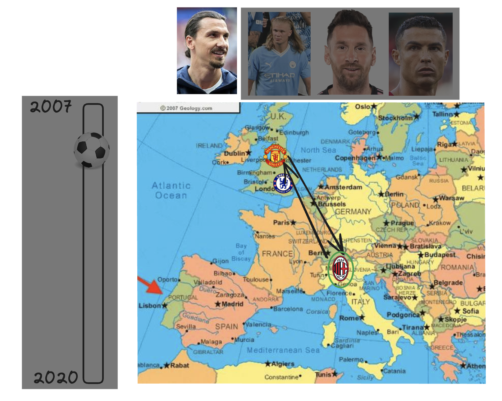
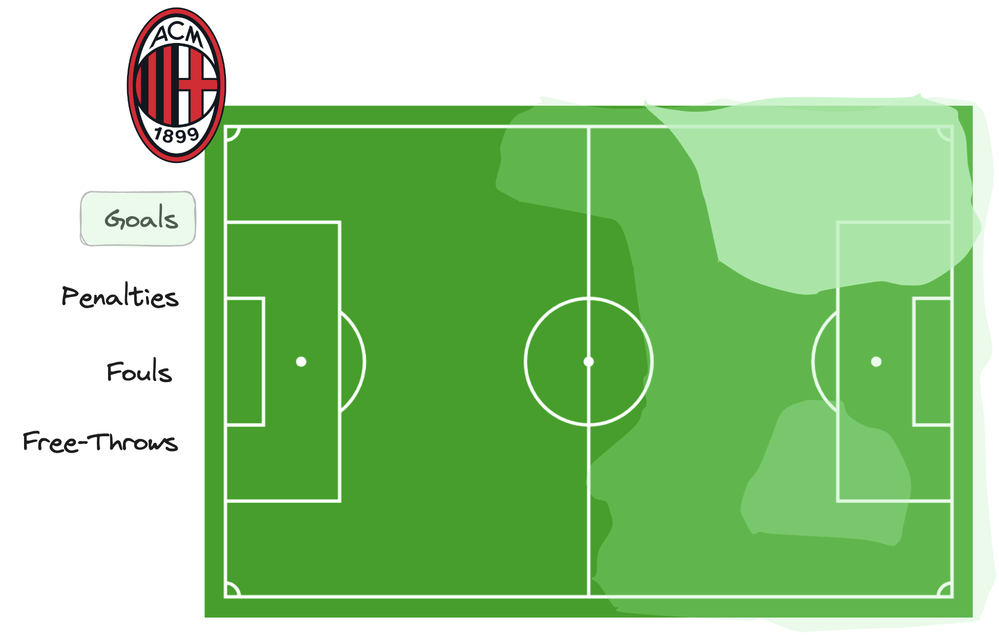
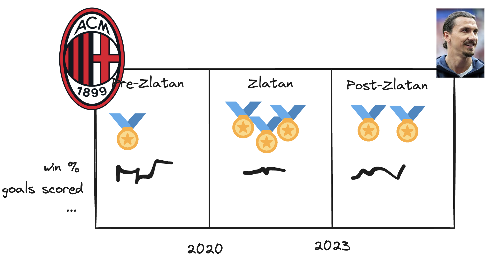

# Project of Data Visualization (COM-480)

| Student's name                 | SCIPER |
| ------------------------------ | ------ |
| Halvor Linder Henriksen        | 379433 |
| Nils Holger Anders Johansson   | 376469 |
| Arran Øystein Kostveit Gabriel | 375923 |

[Milestone 1](#milestone-1) • [Milestone 2](#milestone-2) • [Milestone 3](#milestone-3)

## Milestone 1 (29th March, 5pm)

### Dataset

We will mainly use one dataset from kaggle.com and one dataset published on github.com. The dataset from kaggle.com is
_Football Events_ (published by Alin Secareanu [@secareanualin](https://www.kaggle.com/secareanualin), downloaded
2024-03-12, [kaggle.com](https://www.kaggle.com/datasets/secareanualin/football-events?select=events.csv)) and the other
is _Football
transfers dataset_ that is scraped from the web and published on github.com (published by Dmitrii
Antipov [@d2ski](https://github.com/d2ski),
downloaded 2024-03-12, [github.com](https://github.com/d2ski/football-transfers-data)). In this project we only intend
to visualize
the events and transfers for a handful of players which we choose based on interest. This allows us to choose players
with sufficient and high quality data which reduces the amount of data processing required.

The _Football Events_ dataset is generally of high quality data. The data consists of over 900000 events that have
occurred during football games from 2011/2012 season to 2017-01-27. Each event is tagged with the player that triggered
the event together with a description of what happened. For example if a foul is committed or a goal is scored. The
processing required is to project where the event happened on the pitch to a map of a football pitch. The
description of where the event happened is categorized into 19 different locations like ‘Right wing’ or ‘Attacking
Half’. The location descriptions are not very precise so we need to decide where to place it on the map but since the
project is about visualization the correctness of the placements are not important.

The _Football transfers dataset_ is also well ordered and of high quality. The dataset contains all transfers for the
seven largest European leagues between 2009 - 2021. To connect the two datasets we need to use player names but this
will again be easy since we only will use a few players and possible duplicates can be removed manually. The two
datasets are not covering the exact same years but since we will not compare data between the sets that is also not a
problem.

In conclusion the two main datasets we will use throughout the project are of high quality and do not require
much processing.

### Problematic

We want to visualize the careers of football players in Europe’s top clubs. We want to select a handful of top players
and display their transfer history as a directed graph on a map, where nodes represent clubs/cities and directed edges
represent transfers. In addition, we also want to show further information, like how players have performed throughout
their careers and players that have played together at some point in time.

The beautiful game of football unfolds not just on the pitch, but also in the movement of players between clubs. The
transfer market is becoming an increasingly important part of football. This project aims to capture and make available
this part of the game. By visualizing the transfer history of players as an interactive map, we'll bring their careers
to life, showcasing the clubs they've called home, their impacts at these clubs, and the evolution of transfer fees. But
the story goes beyond destinations. We'll delve into player performance data to paint a more complete picture – how
their play developed across different teams, and highlight instances where players crossed paths.

The project seeks to answer these questions:

<ol>
<li>
Player Career Visualization: How can we effectively visualize the career trajectories of top football players,
highlighting their transfers between clubs and showcasing their performance over time?
</li>
<li>
Club Analysis: What insights can we derive from analyzing the performance and playstyles of clubs these players have
been associated with? How do transfers impact club dynamics and results?
</li>
</ol>
Importantly we want to make the data interesting and easily digestible for football fans and others alike. Building
intuitive and rich visualizations will be paramount in achieving this goal.

### Exploratory Data Analysis

We have examined the two datasets we intend to use as our main data for the project, _Football Events_ and _Football
transfers dataset_.

#### _Football Events_

Our concerns about the data from the first inspection was correct. The last year for the collected data, 2017, is not
complete but that was already known and we have discussed before how this is not a problem for the project.
Another potential problem is that the positional data of the events is not precise. However, we believe we can handle
that by
manually mapping the different positions to some places on the pitch like discussed above. We also encountered
another fault in the positional data that we did not know about before, namely that only about one third of the events
have
positional data. Luckily most moments of play such as goals have a location and we believe that it is enough for us to
be able to complete the project.

Some interesting facts found is that most goals are scored in the bottom corners of the goal but most attempts are made
in the centre.

#### _Football transfers dataset_

The dataset contains rows for every player transfer, loan, and retirement in both directions. Meaning that there are
rows
for both the "receiving" and "giving" clubs. It is hard to test the completeness of the dataset but since we are only
interested in a few players it can easily be tested manually. Some false data discovered is that there are at least 13
transfers in Serie A with reported transfer fee amounts that are too high. The largest transfer knows is when Neymar
transferred from FC Barcelona to Paris SG for 220 million Euro but some of the transfers in Serie A have up to 550
million Euro transfer fee amounts reported.

Some interesting facts and statistics from the data when retirements and end of loans are excluded:

- Average transfers (including loans) per season is 1785,62 for the seasons 2009 - 2021.
- The club acquiring most players (excluding loans and retirements) is Genoa CFC acquiring a total of 271 players
  between 2009 - 2021. The average amount of acquiring (excluding loans) per club and season is 5,72.
- The player with most transfers (including loans) is Gaël Kakuta from France who did 13 transfers between 2009 - 2021.
  The last transfer was not between clubs but going from a loan to a contract within RC Lens. The average amount of
  transfers (including loans) per player and season is 0,14.
- The player with most transfers (excluding loans) is Kevin-Prince Boateng who did 10 transfers between 2009 - 2021. The
  average amount of transfers (excluding loans) per player and season is 0,12.

### Related work

There are several projects done on this topic, for example:

<ul>
<li>

[_The Beautiful Game - Analysis of Football
Events_](https://www.kaggle.com/code/ahmedyoussef/the-beautiful-game-analysis-of-football-events/report) which presents
interesting charts of the Football Events dataset.

</li>
<li>

[_Football transfer infographic_](https://www.slow-journalism.com/infographics/sport/through-the-transfer-window-2)
which maps the rumored and actual transfers for a year in Premier League.

</li>
<li>

[_INFOGRAPHIC: From Gareth Bale to Luis Suarez, the most expensive signings in
football_](https://www.scmp.com/infographics/article/1855915/infographic-gareth-bale-luis-suarez-most-expensive-signings-football)
which dives into the largest transfers.

</li>
</ul>
In our project we want to present the same data as above but from another perspective. We want to showcase the career of
some key players in Europe in the last decade by following their transfers on a geographical map and then displaying the
game events they trigger on the football pitch. We hope this will bring even more insights about some already well known
players.

The inspiration we have taken is both from geographical data visualizations with interactions that often are interesting
and entertaining to view and very specific, deep diving visualizations like the Beatles song example showcased in class.

None of the team's participants have used the data before in any class or have some prior experiences with it.

## Milestone 2 (26th April, 5pm)

### Sketches of initial visualization ideas

#### 1: Player / Club - map

TODO: Explain the idea

#### 2: Club match event heatmap

TODO: Explain the idea

#### 3: Club timeline

TODO: Explain the idea

### MVP website

A rough first version of our visualization can be found at the following [link](https://com-480-data-visualization.github.io/Nordic-Nerds/).

**10% of the final grade**

## Milestone 3 (31st May, 5pm)

**80% of the final grade**
